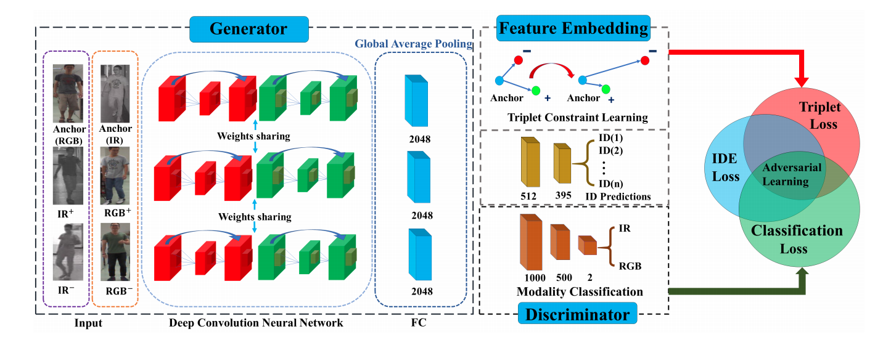

# Cross-modal-PRID-GAN

Code for the IJCAI 2018 paper [Cross-Modality Person Re-Identification with Generative Adversarial Training](https://www.ijcai.org/proceedings/2018/94) . This model performs adversarial learning on multi-modal images (RGB and Infrared) to perform re-identification across modalities. 

	

## Update: 

This code is under active development (after almost 2 years). I hope to add results and models by summer 2021! Stay tuned :)
